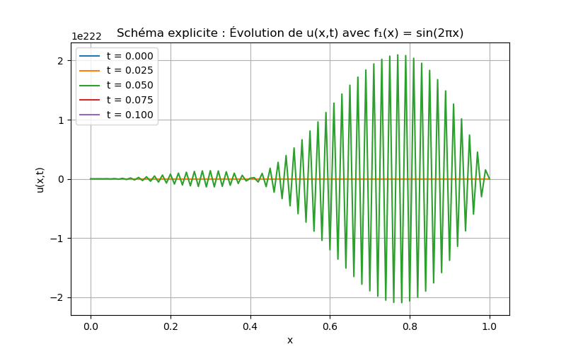
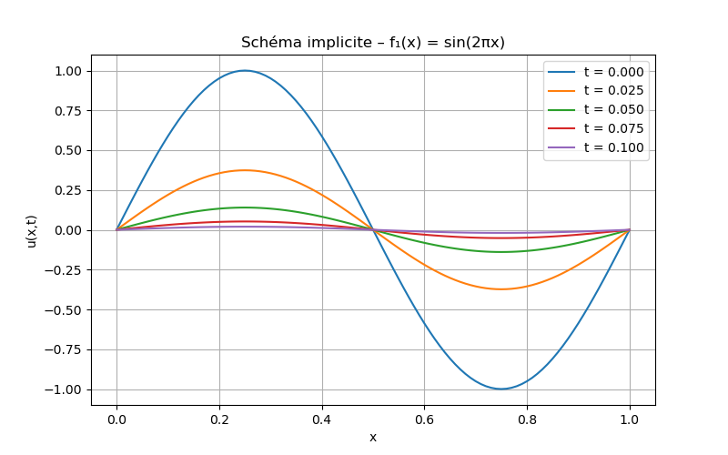
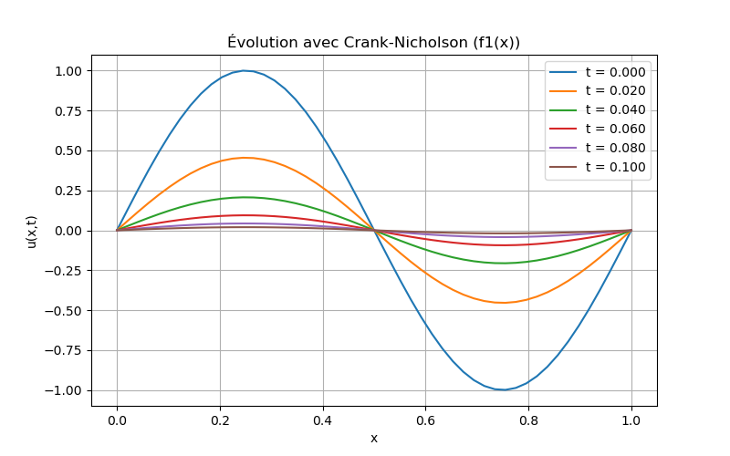
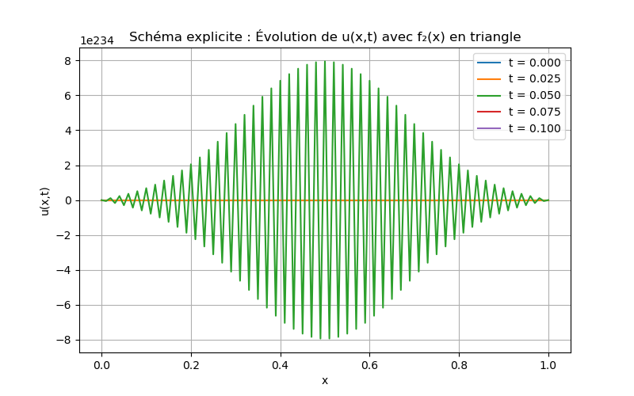
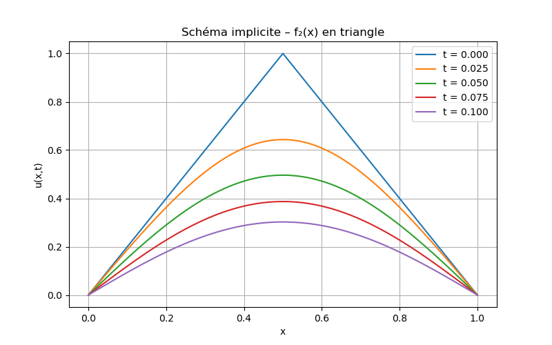
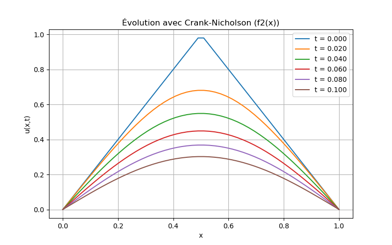

# Q5 : Représentation des différents schémas pour $\ f1(x)$ et $\ f2(x)$ 

## Comparaison des schémas numériques pour $\ f_1(x) = \sin(2\pi x) $

| Critère               | Schéma Explicite          | Schéma Implicite          | Schéma de Crank-Nicholson  |
|-----------------------|--------------------------|--------------------------|---------------------------|
| **Stabilité**         | Conditionnelle $\Delta t \leq \frac{\Delta x^2}{2}$ | Inconditionnelle | Inconditionnelle          |
| **Précision**         | $\  O(\Delta t + \Delta x^2) $ | $\ O(\Delta t + \Delta x^2)$ | $\ O(\Delta t^2 + \Delta x^2)$ |
| **Comportement**      | Décroissance exponentielle, risque d'oscillations si $\ \Delta t $ trop grand | Décroissance lisse, stable | Décroissance précise, pas d'oscillations |
| **Coût calculatoire** | Faible (si $\ \Delta t $ petit) | Élevé (résolution de systèmes linéaires) | Élevé (mais meilleure précision) |
| **Recommandation**    | À éviter pour $\ \Delta t $ grand | Bon compromis stabilité/précision | Optimal pour la précision temporelle |

> **Observation** : Dans nos simulations, le schéma explicite montre des instabilités pour $\ \Delta t = 0.001 $, tandis que Crank-Nicholson capture parfaitement la décroissance analytique.

## Comparaison des schémas numériques pour $\ f_2(x) = 2x + 2(1-x) $

| Critère               | Schéma Explicite          | Schéma Implicite          | Schéma de Crank-Nicholson  |
|-----------------------|--------------------------|--------------------------|---------------------------|
| **Stabilité**         | Conditionnelle ($ \Delta t \leq \frac{\Delta x^2}{2} $) | Inconditionnelle | Inconditionnelle          |
| **Précision**         | $ O(\Delta t + \Delta x^2)  $| $ O(\Delta t + \Delta x^2)  $| $ O(\Delta t^2 + \Delta x^2)  $|
| **Comportement**      | Risque d'oscillations aux discontinuités (Gibbs) | Lissage progressif, stable | Capte mieux les discontinuités, moins de diffusion |
| **Coût calculatoire** | Faible (si $ \Delta t $ $petit) | Élevé (résolution de systèmes) | Élevé (mais précision supérieure) |
| **Recommandation**    | Éviter (instable pour $ f_2 $) | Adapté pour un lissage contrôlé | Optimal pour résoudre les discontinuités |

> **Observation** :  
> - Pour $\ f_2(x) $, le schéma explicite montre des oscillations non physiques (voir `explicite_solution_f2.png`), tandis que l’implicite et Crank-Nicholson restent stables.  
> - Crank-Nicholson offre un meilleur compromis entre précision et stabilité, captant la discontinuité sans sur-lissage.

## Citations connues 

“Peu importe combien votre théorie est belle, peu importe votre intelligence, peu importe si vous êtes célèbre… Si votre théorie n'est pas en accord avec l'expérience, elle est fausse. C'est tout.” 
_Richard Feynman_

"Ainsi derniers seront les premiers et les premiers seront les derniers" 
_Bible, Mathieu 20:16_

"Seul deux choses sont infinies : l'univers et la bêtise humaine.
Mais je ne suis pas sûr pour l'univers"
_Albert Einstein_
