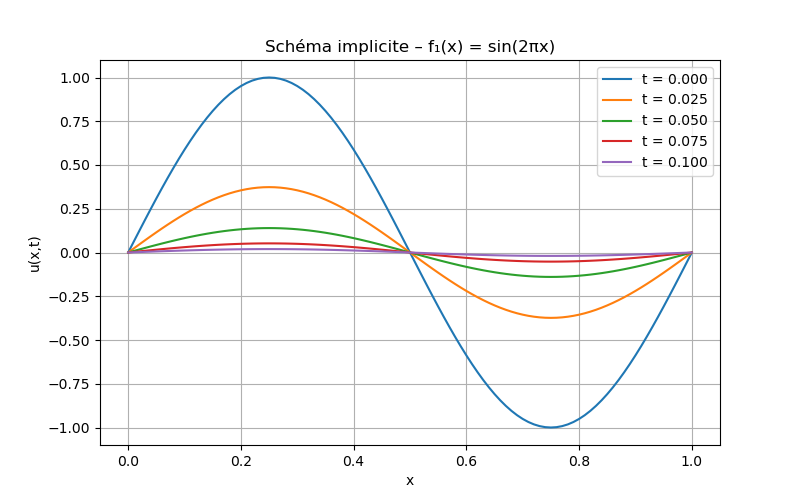

# Q5 : Représentation des différents schémas pour $\ f1(x)$ et $\ f2(x)$ 

## Comparaison des schémas numériques pour $\ f_1(x) = \sin(2\pi x) $

| Critère               | Schéma Explicite          | Schéma Implicite          | Schéma de Crank-Nicholson  |
|-----------------------|--------------------------|--------------------------|---------------------------|
| **Stabilité**         | Conditionnelle $\Delta t \leq \frac{\Delta x^2}{2}$ | Inconditionnelle | Inconditionnelle          |
| **Précision**         | $\  O(\Delta t + \Delta x^2) $ | $\ O(\Delta t + \Delta x^2)$ | $\ O(\Delta t^2 + \Delta x^2)$ |
| **Comportement**      | Décroissance exponentielle, risque d'oscillations si $\ \Delta t $ trop grand | Décroissance lisse, stable | Décroissance précise, pas d'oscillations |
| **Coût calculatoire** | Faible (si $\ \Delta t $ petit) | Élevé (résolution de systèmes linéaires) | Élevé (mais meilleure précision) |
| **Recommandation**    | À éviter pour $\ \Delta t $ grand | Bon compromis stabilité/précision | Optimal pour la précision temporelle |

> **Observation** : Dans nos simulations, le schéma explicite montre des instabilités pour $\ \Delta t = 0.001 $, tandis que Crank-Nicholson capture parfaitement la décroissance analytique.

## Comparaison des schémas numériques pour $\ f_2(x) = 2x + 2(1-x) $

| Critère               | Schéma Explicite          | Schéma Implicite          | Schéma de Crank-Nicholson  |
|-----------------------|--------------------------|--------------------------|---------------------------|
| **Stabilité**         | Conditionnelle ($ \Delta t \leq \frac{\Delta x^2}{2} $) | Inconditionnelle | Inconditionnelle          |
| **Précision**         | $ O(\Delta t + \Delta x^2)  $| $ O(\Delta t + \Delta x^2)  $| $ O(\Delta t^2 + \Delta x^2)  $|
| **Comportement**      | Risque d'oscillations aux discontinuités (Gibbs) | Lissage progressif, stable | Capte mieux les discontinuités, moins de diffusion |
| **Coût calculatoire** | Faible (si $ \Delta t $ $petit) | Élevé (résolution de systèmes) | Élevé (mais précision supérieure) |
| **Recommandation**    | Éviter (instable pour $ f_2 $) | Adapté pour un lissage contrôlé | Optimal pour résoudre les discontinuités |

> **Observation** :  
> - Pour $\ f_2(x) $, le schéma explicite montre des oscillations non physiques (voir `explicite_solution_f2.png`), tandis que l’implicite et Crank-Nicholson restent stables.  
> - Crank-Nicholson offre un meilleur compromis entre précision et stabilité, captant la discontinuité sans sur-lissage.